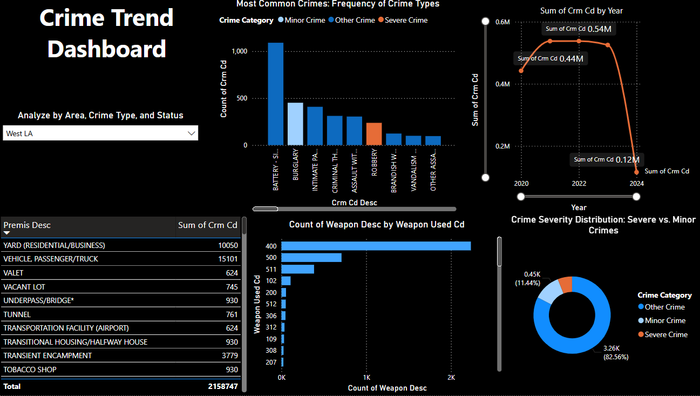
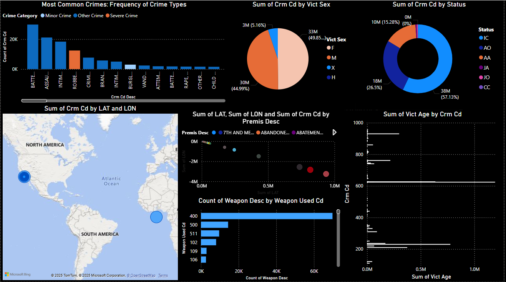

# 📊 Los Angeles Crime Trend Analysis Dashboard

This project is an interactive Power BI dashboard that analyzes crime trends in Los Angeles based on publicly available data. It breaks down patterns by crime type, severity, time, location, victim demographics, and weapon usage.

---

## 🌎 Why This Project?

As a data enthusiast from India, I wanted to apply my analytical skills to a real-world, international dataset. Los Angeles, being a major metropolitan city with rich open data, was the perfect case study. This dashboard helped me understand urban crime patterns and gain hands-on experience in data visualization and storytelling.

---

## 🔍 Key Insights

- Crime incidents have significantly dropped from 2022 to 2024.
- Minor crimes make up the majority, but severe crimes have consistent presence.
- Battery and burglary are among the most common crimes.
- Gender and age distribution of victims reveals important social insights.
- Crime hot spots are geographically identifiable through mapping.

---

## 🛠 Tools & Tech

- **Power BI** for interactive dashboards
- **DAX** for calculations
- **Power Query** for data transformation
- **Bing Maps** for geospatial analysis

---

## 📁 Data Source

The data was sourced from the website. Due to privacy and size constraints, raw data is not included in this repository. You can access and explore the dataset directly from the official portal.

---

## 📸 Screenshot

---

## 📬 Contact

If you're interested in collaborating, feel free to connect with me or reach out with feedback!
www.linkedin.com/in/anshini-kumbhare

